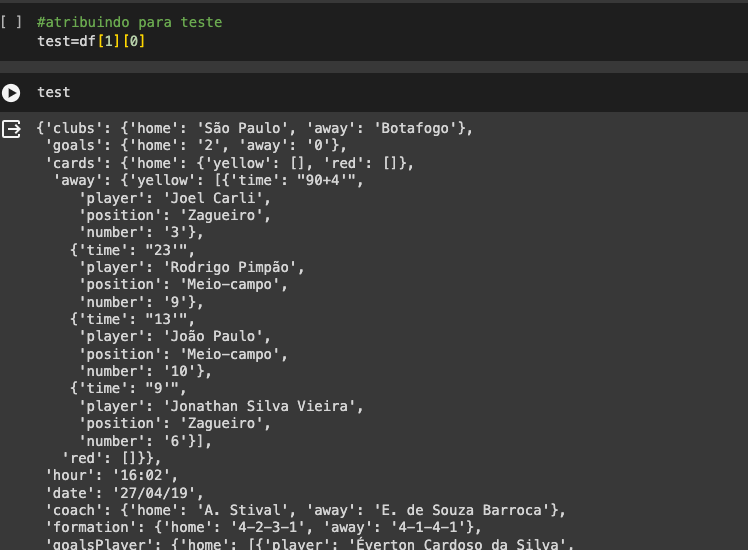
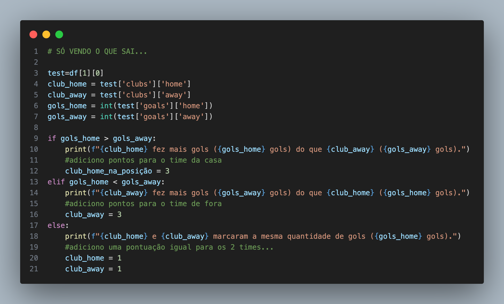
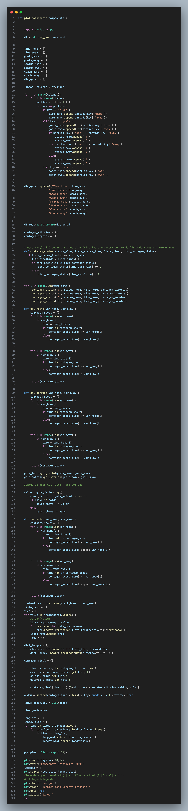
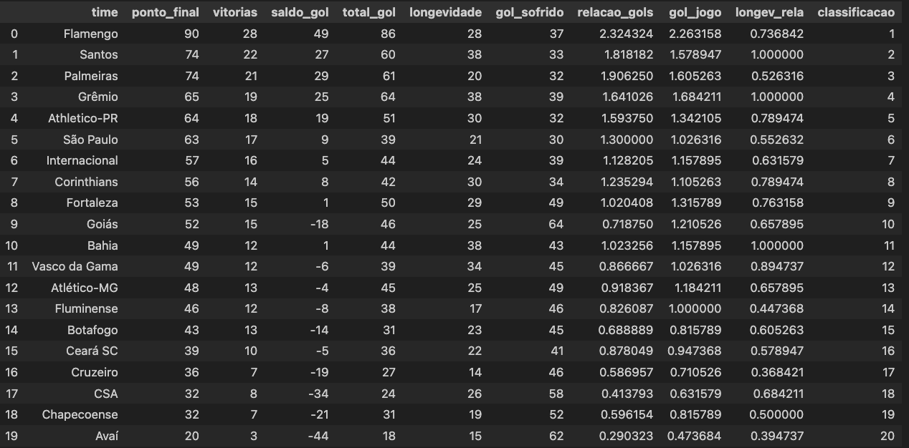
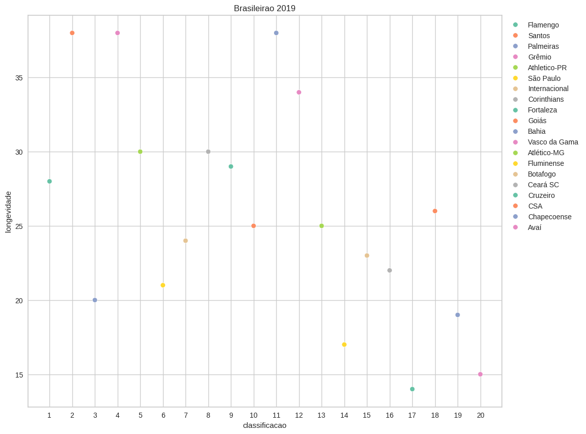
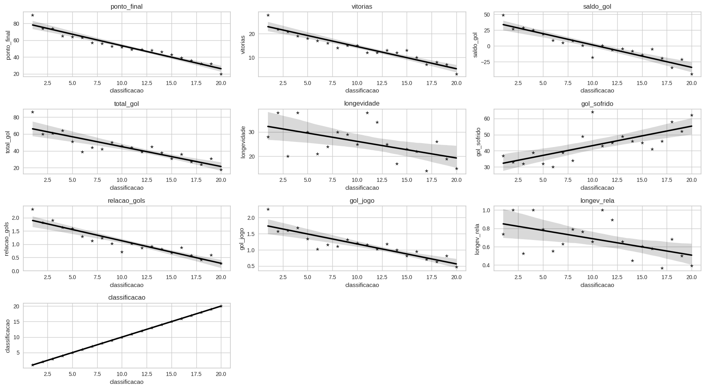
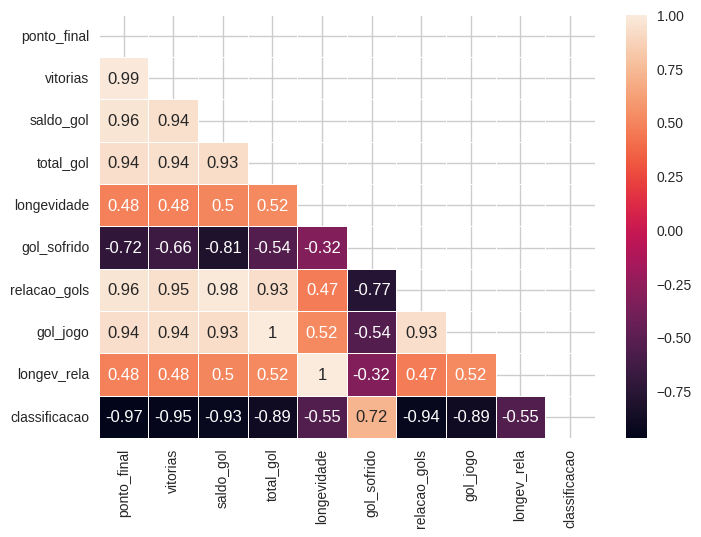

# Brasileirão e Serie A

O **Campeonato Brasileiro**, também conhecido como **Brasileirão** e **Série A**, é a liga brasileira de futebol profissional entre clubes do Brasil, sendo a principal competição de futebol no país. É nela que são indicados os representantes brasileiros para a Copa Libertadores da América, juntamente com o campeão da Copa do Brasil. O campeão do torneio também conquista uma vaga na Supercopa do Brasil no ano seguinte.

# Escopo do projeto

#### Para reprodutibilidade do PR sugere a seguintes oreientações

```
bash
conda create -n AdaPrPy1 python = 3.11
conda activate AdaPrPy1 
pip install -r Requirements.txt

```

O projeto tem como base as fases o uso do CRISP-DM para solucao do problema, com pequenas adapatações para o **PR_V1**

Seguindo as seguintes etapas:

1. Business understanding
2. Data Understanding
3. Data Preparation
4. Modeling
5. Evaluation
6. Deploy
7. Feedbacks


### PS: o V1 nao comtempla o Deploy e Feedbacks apos o deploy.

# Business understanding


Uma nova a equipe profissional, o **ADA-Santander Futebol Clube**, emerge no cenário nacional com uma visão revolucionária. Sua diretoria e gerência estão empenhadas em transformar o panorama do futebol, não apenas no âmbito nacional, mas também em escala global. Acreditam firmemente que os dados, até então subutilizados, são a chave para o sucesso, contrastando com a abordagem tradicional e muitas vezes emocional que permeia as decisões no esporte.

 A ADA-Santander Futebol Clube está adotando uma abordagem inovadora ao implementar uma administração baseada em dados (DATA-DRIVEN). Esta mudança abrange diversos setores cruciais para o desempenho do clube, incluindo contratações, renovações de contratos, negociações salariais, demissões e até mesmo a seleção e contratação de técnicos.

Acreditando que a análise de dados pode fornecer insights valiosos e informar estratégias mais eficazes, a equipe está comprometida em trazer uma mentalidade mais fundamentada e científica para as decisões que impactam diretamente o desempenho e o sucesso da equipe Essa abordagem inovadora busca não apenas melhorar os resultados no campo, mas também estabelecer um novo padrão de excelência no universo do futebol, destacando-se pela eficiência, planejamento estratégico e vanguarda tecnológica.


# Data Understanding

Foi usado um dataset modelo (campeonato brasileiro de 2019), contendo a estrura de em formato JSON, com total de 38 colunas e 10 linhas ao total.

Nao ha dados duplicados, ou valores Nan ou nulos dentro do nosso dataset

Para cada celula continham dados estatisticos dos jogos de cada rodada.



Foi usado um um codigo de teste para extrair as informacoes necessarias para apenas 1 unica celula



# Data Preparation 

Para a preparacao dos dados,  criamos uma funcao onde ela recebe um parametro que vai ser a o dataset a ser analisado, segue um exemplo do codigo implemenado.

Os dados foram retiradas e trabalhadas para obtermos as informacoes de colocacaoes final, saldo de gol, longevidade de do tecnicos, gol feito



## Obtendo um resultado 



# Conclusao Final

O questionamento levantado pela diretoria se há uma relacao entre Longevidade e Posicao final  dos times, foi pode ser respondida de forma taxativa. 



Porém, para responder de uma maneira mais visual foi usado o grafico de regressão e um heatmap para entender a correlaçāo entre as variáveis

**REGPLOT**



**HEATMAP**



Atraves desses dois graficos podemos entender que longevidade apresenta um correlacao de media com a colocacao final, porem como estamos analisando apenas um unico ano, nao podemos afimar de maneira mais efusiva, evitando um um vies da nossa analise

# Muito Obrigado
**Colaboradores**

Ane Carol

Chen Yen Pin

Jesya

Gabriel

Gabriel

Grabriela

Renna

Marcel


